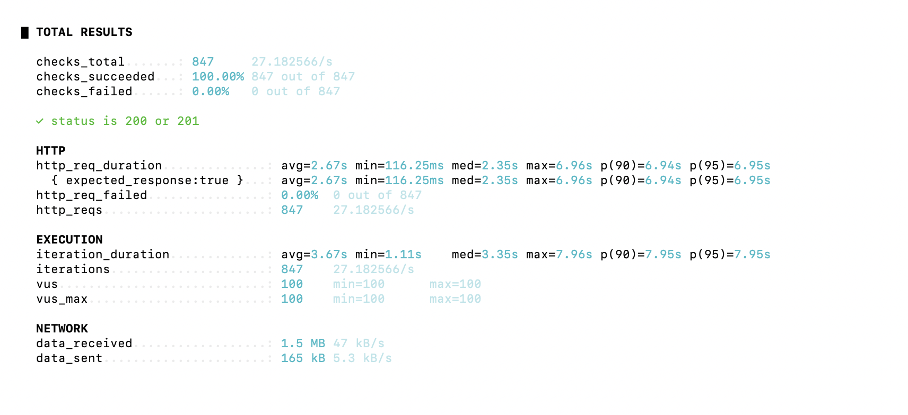
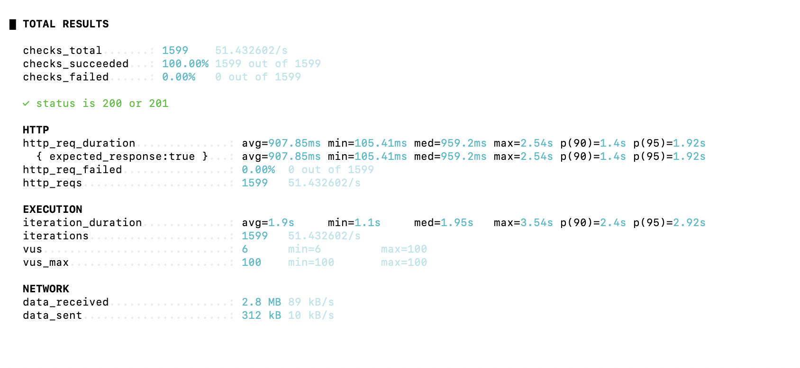

## 🚥 부하 테스트
[🔝 메인 목차로 이동](../../readme.md)

서비스의 병목 구간과 응답 시간을 확인하기 위해 `k6`를 사용해 부하 테스트를 진행했습니다.  
수집된 메트릭은 `InfluxDB`에 적재하고, `Grafana` 대시보드를 통해 응답 시간, 처리량, 가상 사용자 수를 시각적으로 분석했습니다.

### 테스트 환경
- 테스트 도구: `k6`
- 메트릭 저장소: `InfluxDB`
- 시각화 도구: `Grafana`

### 테스트 대상
- 회원가입
- 로그인
- 유저 정보 수정
- 면접 생성

### 회원 가입
<details>
<summary>회원 가입 부하 테스트</summary>

<p align="center">
  
  
</p>

부하 테스트 스크립트는 [`k6/signup-test.js`](../../k6/signup-test.js) 에서 확인할 수 있습니다.

📊 테스트 결과 해석

```
- avg=1.99s
- med=1.92s
- p95=2.9s
- 실패율 0%
```

✔ 긍정적인 점<br/>
모든 요청이 정상 처리되어 **실패율이 0%**로 나타남<br/>
동시 사용자 100명 수준에서도 시스템이 안정적으로 동작<br/>
p95가 3초 이내로, 부하 상황에서도 완전히 붕괴하지 않음

⚠ 아쉬운 점<br/>
중앙값(median)이 1.92초로, 대부분의 요청이 약 2초에 가까운 응답 시간을 보임<br/>
일부 요청만 느린 것이 아니라 전체적으로 응답 시간이 높은 상태<br/>
회원가입 API 기준으로는 사용자가 체감하기에 다소 느린 응답 속도<br/>

📌 분석

해당 결과는 특정 구간의 병목이 아닌,<br/>
요청 처리 과정 전반에서 일정한 비용이 발생하고 있음을 의미합니다.

특히 다음 요소들이 주요 원인으로 판단됩니다:

bcrypt 해싱 과정에서 발생하는 CPU 연산 비용<br/>
HTTPS 및 Gateway를 거치는 네트워크 처리 비용<br/>
회원가입 시 발생하는 다수의 DB write 및 트랜잭션 commit 비용<br/>

✅ 결론

시스템은 동시 요청 상황에서도 안정적으로 동작함을 확인<br/>
다만 평균 및 중앙값이 약 2초 수준으로 나타나<br/>
응답 성능 개선 여지가 존재

향후에는 다음과 같은 방향으로 개선을 고려할 수 있습니다:

bcrypt cost factor 조정 또는 인증 서버 분리<br/>
DB write 구조 최적화
</details>


### 로그인
<details>
<summary>로그인 부하 테스트</summary>

<p align="center">
  
  
</p>

부하 테스트 스크립트는 [`k6/login-test.js`](../../k6/login-test.js) 에서 확인할 수 있습니다.

📊 테스트 결과 해석

```
동기                  비동기
- avg=2.67s         avg=907ms
- med=2.35s         med=959ms
- p95=6.9s          1.92s
- 실패율 0%          실패율 0%
```

### 🔧 로그인 처리 구조 개선 (동기 → 비동기 전환)

로그인 성능 저하의 원인을 분석한 결과,<br/>
인증 성공 이후 user-service로 전달되는 동기 HTTP 호출이 추가 latency를 유발하고 있음을 확인했습니다.<br/>
기존 구조에서는 로그인 요청 시 외부 서비스 응답을 기다리는 blocking 방식으로 처리되어, <br/>
동시 요청이 증가할 경우 응답 지연과 tail latency(p95)가 크게 증가하는 문제가 발생했습니다.<br/>
이를 해결하기 위해 해당 로직을 Kafka 기반 비동기 이벤트 처리 방식으로 전환했습니다.

#### Before (동기 구조)

로그인 → 인증 → user-service HTTP 호출 → 응답 반환

- 외부 서비스 응답을 기다리는 blocking 구조
- user-service 장애가 로그인 실패로 전파
- 동시 요청 증가 시 스레드 점유로 인해 지연 발생

#### After (비동기 구조)

로그인 → 인증 → Kafka 이벤트 발행 → 응답 반환

- 외부 서비스 호출 제거
- 로그인 핵심 경로와 부가 로직 분리
- kafka 이벤트 기반으로 user-service에서 후처리 수행

## 📊 개선 효과
- median: 약 2.5s → 1.46s
- p95: 약 8s → 2.48s

동기 HTTP 호출 제거를 통해 tail latency를 크게 개선했으며, 로그인 요청 처리의 안정성을 확보했습니다.

### ⚠ 아쉬운 점 및 개선 방향

현재 구조에서는 Kafka 이벤트를 직접 발행하는 방식으로 구현되어 있어, 이벤트 유실 가능성이 존재합니다.<br/>
로그인 성공 이벤트는 치명적인 데이터는 아니지만,<br/>
보다 높은 신뢰성이 요구되는 경우 Outbox 패턴을 적용하여 메시지 전달 보장을 강화할 수 있습니다.<br/>
또한 로그인 응답 시간은 여전히 bcrypt 비밀번호 검증 비용에 의해 영향을 받고 있어,<br/>
향후 인증 서버 스케일 아웃 또는 cost factor 조정 등의 추가적인 성능 개선이 필요합니다.

<details>
<summary>소스 변경 점</summary>

```
동기 방식 개선 
    public LoginResponse login(UserLoginRequest request , HttpServletResponse response) {
            ...
        userClient.resetFailCount(loginUser.getUserId());
    }

    public void resetFailCount(Long userId) {
            if (userId == null) {
                throw new CustomApiException(ERR_001.getHttpStatus(), ERR_001, "유저 정보는 " + ERR_001);
            }
            userRestClient.patch()
                    .uri("/api/users/v1/internal/login-success")
                    .body(new LoginSuccessRequest(userId))
                    .retrieve()
                    .onStatus(status -> status.value() == 404, (req, res) -> {
                        throw new BadCredentialsException("아이디 또는 비밀번호가 올바르지 않습니다.");
                    })
                    .onStatus(status -> status.is5xxServerError(), (req, res) -> {
                        throw new CustomApiException(ILLEGALSTATE.getHttpStatus(), ILLEGALSTATE,"user-service reset fail 5xx 호출");
                    })
                    .onStatus(status -> status.is4xxClientError(), (req, res) -> {
                        throw new CustomApiException(ERR_000.getHttpStatus(), ERR_000,"user-service reset fail 4xx 호출 실패");
                    })
                    .toBodilessEntity();
    }
    
    비동기 kafka 이벤트
    public LoginResponse login(UserLoginRequest request , HttpServletResponse response) {
                 ...
         loginSuccessEventProducer.publish(loginUser.getUserId());
     }
     
     public class LoginSuccessEventProducer {

            private static final String TOPIC = "user.login.success";
        
            private final KafkaTemplate<String, String> kafkaTemplate;
            private final ObjectMapper objectMapper;
        
            public void publish(Long userId) {
                try {
                    LoginSuccessEvent event = new LoginSuccessEvent(userId, OffsetDateTime.now());
                    String payload = objectMapper.writeValueAsString(event);
        
                    kafkaTemplate.send(TOPIC, String.valueOf(userId), payload);
                    log.info("published login success event. userId={}", userId);
                } catch (JsonProcessingException e) {
                    log.error("failed to serialize login success event. userId={}", userId, e);
                } catch (Exception e) {
                    log.error("failed to publish login success event. userId={}", userId, e);
                }
            }
    }
    
    core-user-service
     @KafkaListener(topics = "user.login.success", groupId = "core-service-login-success")
     public void consume(String message) {
        try {
            LoginSuccessEvent event = objectMapper.readValue(message, LoginSuccessEvent.class);
            userService.resetFailCount(event.userId());
            log.info("consumed login success event. userId={}", event.userId());
        } catch (Exception e) {
            log.error("failed to consume login success event. message={}", message, e);
            throw new RuntimeException(e);
        }
    }
     
```
 </details>

</details>


### 유저 정보 수정
<details>
<summary>유저 정보 수정 부하 테스트</summary>

<p align="center">
  
  
</p>

부하 테스트 스크립트는 [`k6/profile-change-test.js`](../../k6/profile-change-test.js) 에서 확인할 수 있습니다.

📊 테스트 결과 해석

```
이미지 x                 이미지 o (외부 호출)
- avg=95ms              avg=7.3s
- med=21s               med=9.7s
- p95=921ms             p95=11.5s
- 실패율 0%              실패율 0.58%
```

✔ 긍정적인 점<br/>

애플리케이션 자체 성능은 우수
- 이미지 제외 시 평균 95ms, 중앙값 21ms로 매우 빠른 응답 속도
- 대부분 요청이 짧은 시간 내 처리되어 기본 API 구조 및 DB 처리 성능이 안정적
- 
높은 성공률
- 이미지 미포함: 실패율 0%
- 이미지 포함: 실패율 0.58% (대체로 안정적)
- 외부 API 포함 상황에서도 전반적인 시스템 안정성 확보

부하 상황에서도 처리량 유지
- 내부 로직은 병목 없이 확장성 있는 구조로 동작

⚠ 아쉬운 점<br/>
외부 저장소(Cloudinary) 의존으로 인한 응답 지연
- 평균 7.3초, p95 11.5초로 사용자 체감 성능 저하
- 특히 중앙값 9.7초로 대부분 요청이 느린 상태

단일 API에 서로 다른 책임이 혼재
- 닉네임 수정(경량 작업) + 이미지 업로드(고비용 작업)가 하나의 API에 결합
- 불필요하게 전체 응답시간 증가
- 
외부 API 실패 전파 가능성
- 실패율 증가(0% → 0.58%)
- 외부 서비스 장애 시 전체 기능 영향 가능

📌 분석

이미지 제외 시:
- 중앙값 21ms → 대부분 요청이 매우 빠르게 처리됨
- 평균 95ms → 일부 요청만 지연 (GC, 인증, 네트워크 등 영향)

- 이미지 포함 시:
- 중앙값 9.7초 → 거의 모든 요청이 느림
- 평균 7.3초 → 일부 빠른 요청이 평균을 낮춤
- ⇒ Cloudinary 업로드가 전체 응답시간을 지배


응답시간의 대부분이 외부 네트워크 I/O + 파일 업로드 시간<br/>
CPU/DB 문제가 아니라 I/O 바운드 병목<br/>

✅ 결론

부하 테스트 결과, 프로필 수정 API는 내부 로직만 수행할 경우 평균 95ms 수준으로 빠르게 처리되었으며,<br/>
애플리케이션 자체 성능에는 문제가 없음을 확인하였습니다.<br/>
반면 Cloudinary 연동 시 평균 7초 이상, p95 11초 이상으로 응답 시간이 증가하여 외부 이미지 저장소 호출이 주요 병목임을 확인하였습니다.<br/>
이에 따라 텍스트 정보 수정과 이미지 업로드 기능을 분리하거나,<br/>
클라이언트 직접 업로드 방식 등을 통해 응답시간과 사용자 경험을 개선할 필요가 있을거 같습니다.

</details>

### 면접 생성
<details>
<summary>면접 생성 부하 테스트</summary>

<p align="center">
  
</p>

부하 테스트 스크립트는 [`k6/interview-test.js`](../../k6/interview-test.js) 에서 확인할 수 있습니다.

📊 테스트 결과 해석

```              
- avg=929ms          
- med=117ms               
- p95=8.9s            
- 실패율 0%            
```

✔ 긍정적인 점<br/>

동시성 제어 안정성 확보

- userId 기반 락(findByIdForUpdate)과
PENDING / GENERATING / ACTIVE 상태 재사용 로직을 통해
동일 사용자 기준 중복 인터뷰 생성이 효과적으로 방지됨
- idempotencyKey 기반 재요청 처리
동일 요청에 대해 기존 인터뷰를 재사용하도록 구현되어
중복 insert 및 데이터 불일치 문제를 방지
- 트랜잭션 구조 개선
인터뷰 생성과 질문 생성 흐름을 분리하여
긴 트랜잭션으로 인한 락 점유 문제를 완화
- 에러 처리 안정성
AI 호출 실패 시 상태를 FAILED로 전환하여
비정상 상태 데이터 방지 및 재시도 가능 구조 확보

부하 상황에서도 처리량 유지
- 내부 로직은 병목 없이 확장성 있는 구조로 동작

⚠ 아쉬운 점<br/>
- 외부 AI(OpenAI) 호출로 인한 높은 응답 지연
    - p95 기준 약 7~8초 수준으로
일부 요청에서 매우 긴 응답 시간 발생
- 동기 구조로 인한 응답 시간 한계
  - 질문을 즉시 반환해야 하기 때문에
    AI 호출 시간을 그대로 사용자 응답 시간에 반영
- 부하 테스트에서 낮은 처리량
  - 테스트 결과 실제 인터뷰 생성 요청이 9건 수준으로
  throughput이 낮고, 긴 요청 처리 시간이 전체 처리량을 제한
- AI 호출 외 구간 최적화 효과 제한적
  - DB 처리 및 트랜잭션 개선에도 불구하고
  전체 성능은 외부 API latency에 의해 지배됨

    
📌 분석
- 원인:
    - aiServiceClient.generateQuestions() 호출이
전체 처리 시간의 대부분을 차지
- 기존 구조 문제:
  - 인터뷰 생성 + 질문 생성 + AI 호출이
  하나의 트랜잭션으로 묶일 가능성
  → AI 응답 대기 동안 DB 락 유지

✅ 결론
- 이번 개선은 응답 속도 개선보다는 구조적 안정성 개선에 초점을 둔 작업이었습니다.
- 다음과 같은 성과를 확보했습니다:
  - 트랜잭션 분리로 인한 락 점유 시간 감소
  - 동일 사용자 요청에 대한 중복 생성 방지
  - 실패 시 상태 관리 기반 안정적인 재처리 구조 확보
</details>