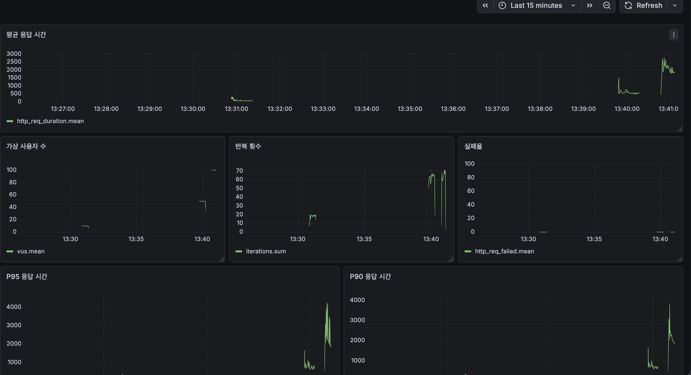
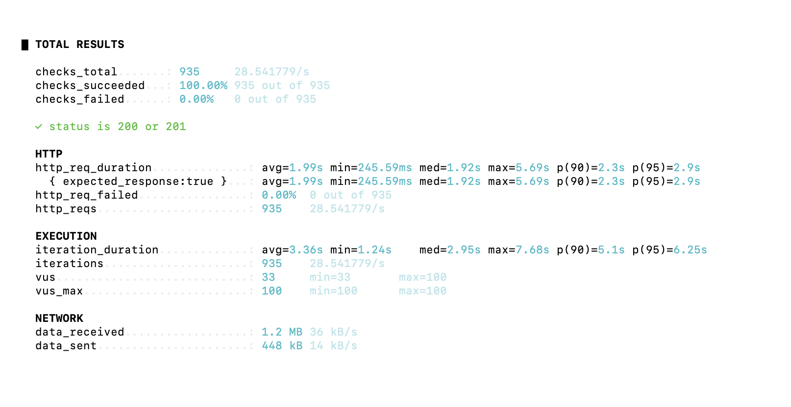

## 🚥 부하 테스트
[🔝 메인 목차로 이동](../../readme.md)

서비스의 병목 구간과 응답 시간을 확인하기 위해 `k6`를 사용해 부하 테스트를 진행했습니다.  
수집된 메트릭은 `InfluxDB`에 적재하고, `Grafana` 대시보드를 통해 응답 시간, 처리량, 가상 사용자 수를 시각적으로 분석했습니다.

### 테스트 환경
- 테스트 도구: `k6`
- 메트릭 저장소: `InfluxDB`
- 시각화 도구: `Grafana`

### 테스트 대상
- 로그인
- 회원가입
- 면접 생성

### 회원 가입
<details>
<summary>회원 가입 부하 테스트</summary>

<p align="center">
  
  
</p>

부하 테스트 스크립트는 [`k6/signup-test.js`](../../k6/signup-test.js) 에서 확인할 수 있습니다.

📊 테스트 결과 해석

```
- avg=1.99s
- med=1.92s
- p95=2.9s
- 실패율 0%
```

✔ 긍정적인 점<br/>
모든 요청이 정상 처리되어 **실패율이 0%**로 나타남<br/>
동시 사용자 100명 수준에서도 시스템이 안정적으로 동작<br/>
p95가 3초 이내로, 부하 상황에서도 완전히 붕괴하지 않음

⚠ 아쉬운 점<br/>
중앙값(median)이 1.92초로, 대부분의 요청이 약 2초에 가까운 응답 시간을 보임<br/>
일부 요청만 느린 것이 아니라 전체적으로 응답 시간이 높은 상태<br/>
회원가입 API 기준으로는 사용자가 체감하기에 다소 느린 응답 속도<br/>

📌 분석

해당 결과는 특정 구간의 병목이 아닌,<br/>
요청 처리 과정 전반에서 일정한 비용이 발생하고 있음을 의미합니다.

특히 다음 요소들이 주요 원인으로 판단됩니다:

bcrypt 해싱 과정에서 발생하는 CPU 연산 비용<br/>
HTTPS 및 Gateway를 거치는 네트워크 처리 비용<br/>
회원가입 시 발생하는 다수의 DB write 및 트랜잭션 commit 비용<br/>

✅ 결론
시스템은 동시 요청 상황에서도 안정적으로 동작함을 확인<br/>
다만 평균 및 중앙값이 약 2초 수준으로 나타나<br/>
응답 성능 개선 여지가 존재

향후에는 다음과 같은 방향으로 개선을 고려할 수 있습니다:

bcrypt cost factor 조정 또는 인증 서버 분리<br/>
DB write 구조 최적화
</details>